# amazon-bestsellers-analytics-pipeline

This project builds a cloud-ready DataOps pipeline to analyze Amazon bestseller patterns using Bruin, Terraform, and GCP.

## Problem Description

The project solves a simple but realistic analytics problem: turning a flat bestseller CSV into a reproducible cloud pipeline that supports author and genre analysis. We enhanced the bestseller CSV by creating a seed that contains the nationality of all the authors.

The business questions we are looking to answer are:

- Which authors appear most often in the bestseller dataset?
- What nationality dominates in the dataset?
- Which genres dominate the dataset overall?
- Which genres dominate the dataset per year?

The pipeline takes local raw files, uploads them to a cloud data lake (Google Cloud Bucket), loads them into the Google Cloud BigQuery warehouse, transforms them into analytics tables using Bruin, and exposes the outputs in a dashboard using Python Streamlit library.

## Demo Data Location

This is a demo course project for data-engineering-zoomcamp, so the raw input files are intentionally stored in the repository under [`pipeline/assets/`](/home/admin/data-engineering/amz-bestsellers-la/pipeline/assets).

For each run:

1. The source files start in `pipeline/assets/`
2. They are uploaded to the GCS raw zone
3. They are loaded and transformed in BigQuery

## Results:

Dashboard author presence

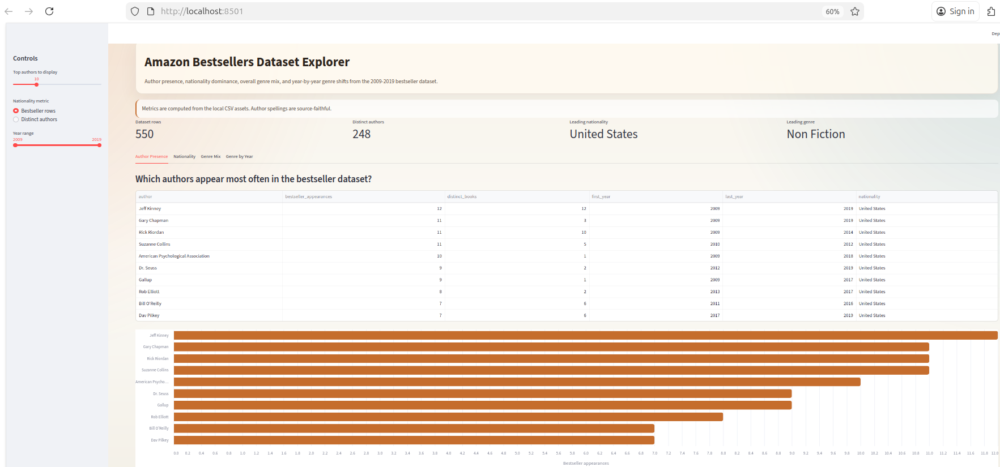

Dashboard Author Nationality

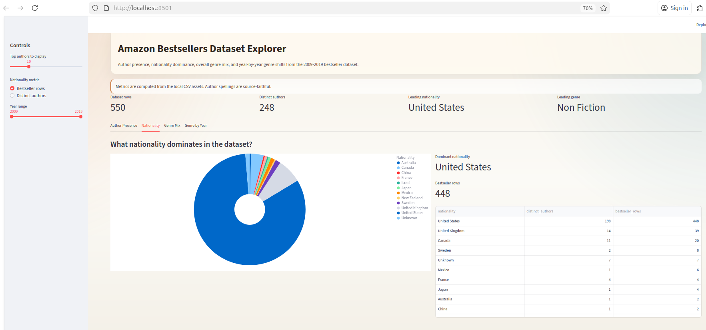

Dashboard Genery Dominance

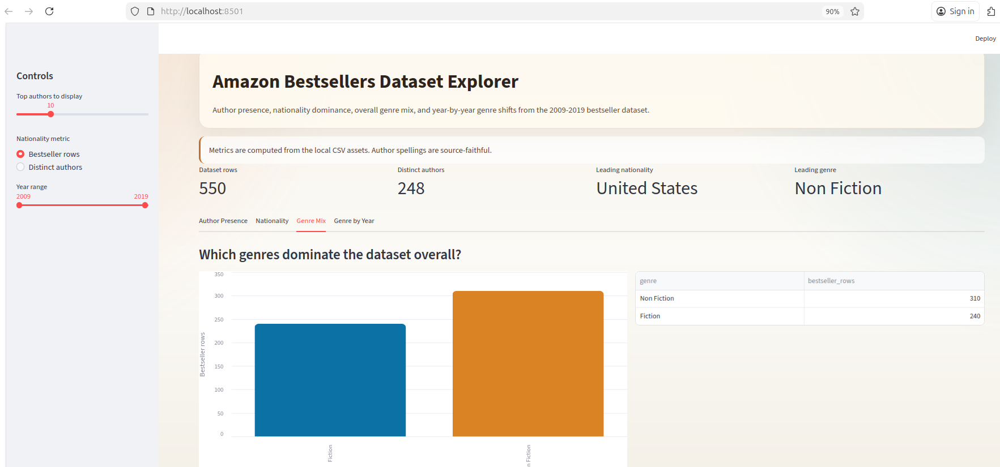

Dashboard Genery by Year

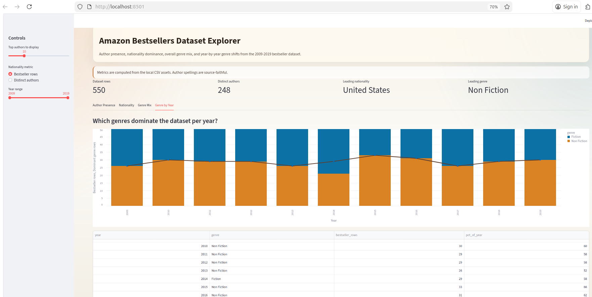


## Quick Start

### Cloud Deployment

#### 1. Manual Infrastructure Setup In GCP

For this project, the recommended approach is to create the cloud infrastructure once with an admin or owner account, and then use GitHub Actions only for pipeline execution and smoke tests.

Create these resources manually in Google Cloud, remember that all resources needs to be on the same region:

1. create a GCS bucket for the raw data lake. For example, your-gcp-project-id-amz-bestsellers-raw

  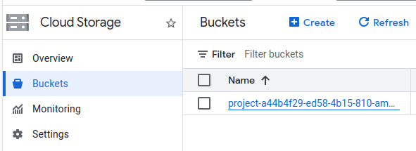

2. create a BigQuery dataset named `raw`

3. create a BigQuery dataset named `analytics`
  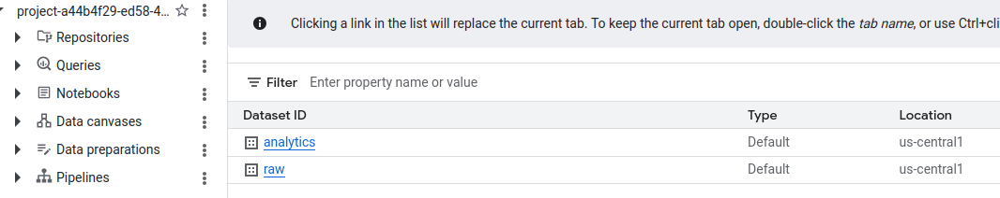

4. create a service account for the pipeline:

    Grant the service account these permissions:
    - `roles/bigquery.dataEditor`
       Allows Bruin can create and update tables in BigQuery.

    - `roles/bigquery.jobUser`
       Allows Bruin can run queries and jobs

    - `roles/storage.objectAdmin` on the raw bucket
       Allows the upload step can place files in the data lake

    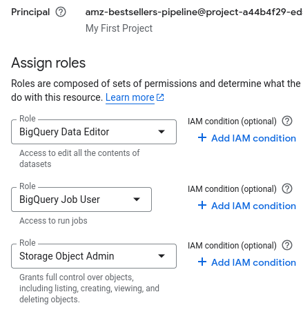

    Download the service account as json and save it as `service-account.json`

    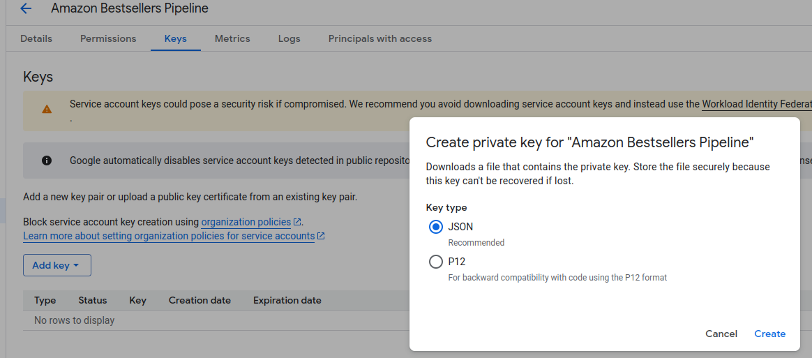 


    Remember to store the json credentials outside the project and set permissions (chmod 600 service-account.json) to restrict the usage only for the owner.


You can create these resources manually from the Google Cloud console (https://console.cloud.google.com) or with `gcloud` commands.


#### 2. Installing requirements to run the pipeline.

In the local environment where you downloaded the repository install the following requirements.


- Install Terraform:
  ```
  sudo apt-get update && sudo apt-get install -y gnupg software-properties-common curl
  ```
  ```
  curl -fsSL https://apt.releases.hashicorp.com/gpg | sudo apt-key add -
  ```
  ```
  sudo apt-add-repository "deb https://apt.releases.hashicorp.com $(lsb_release -cs) main"
  ```
  ```
  sudo apt-get update && sudo apt-get install terraform -y
  ```

- Install Bruin CLI

  ```
  curl -fsSL https://getbruin.com/install/cli | bash
  ```
  After installation, restart your terminal or run:
  ```
  source ~/.bashrc
  ```

- Install Google Cloud SDK (`gcloud`)

  ```
  sudo apt-get update && sudo apt-get install -y apt-transport-https ca-certificates gnupg curl
  ```
  ```
  curl https://packages.cloud.google.com/apt/doc/apt-key.gpg | sudo apt-key add -
  ```
  ```
  echo "deb https://packages.cloud.google.com/apt cloud-sdk main" | sudo tee /etc/apt/sources.list.d/google-cloud-sdk.list
  ```
  ```
  sudo apt-get update && sudo apt-get install google-cloud-sdk -y
  ```
  Initialize Google Cloud, you will be asked to sign in using the Internet Browser
  ```
  gcloud init
  ```
  Select the project where your Google Cloud resources are located.


  Run the following command to enable the required GCP APIs:

    ```bash
    gcloud services enable \
      bigquery.googleapis.com \
      iam.googleapis.com \
      iamcredentials.googleapis.com \
      sts.googleapis.com \
      storage.googleapis.com
    ```

  Authenticate locally from command prompt:

    ```
    export GOOGLE_APPLICATION_CREDENTIALS="$(pwd)/service-account.json"
    ```
    ```
    gcloud auth activate-service-account --key-file="$GOOGLE_APPLICATION_CREDENTIALS"
    ```
    or use if previous command does not work for you:

    ```
    gcloud auth login --cred-file="$GOOGLE_APPLICATION_CREDENTIALS"
    ```

    ```
    gcloud config set project your-gcp-project-id
    ```

Now, we will work to set the python environment:


- Install uv to manage your virtual environment.
  ```
  curl -Ls https://astral.sh/uv/install.sh | bash
  ```
  Reload your shell:
  ```
  source ~/.bashrc
  ```
- Create virtual environment
  ```
  uv venv --python 3.12
  ```
- Activate environment
  ```
  source .venv/bin/activate
  ```

- Install dependencies from lock file
  ```
  uv pip install -r requirements.lock
  ```


#### 3. Configure Bruin

- Copy .bruin.yml.example into .bruin.yml 

  ```bash
  cp .bruin.yml.example .bruin.yml
  ```

- Fill .bruin.yml with information requested in the template.

  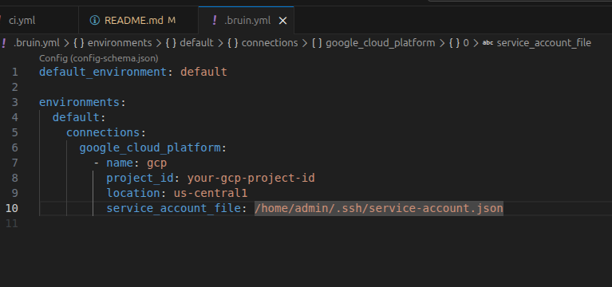

#### 4. Run the Pipeline


- Setup your Bruin environment

  ```
  bruin init
  ```
  Select empty Pipeline option when asked.

- Upload the raw files to the cloud data lake

  ```
  export RAW_DATA_LAKE_BUCKET="your-gcp-project-id-amz-bestsellers-raw"
  ```
  
  Execute the below command to upload the data to the datalake:

  ```make upload-raw
  ```

- Run the Bruin batch DAG in BigQuery
  ```
  make pipeline-cloud
  ```

Image placeholder:


#### 5. Launch Dashboard

Run the dashboard:

```
streamlit run dashboard/app.py
```

Image placeholder:

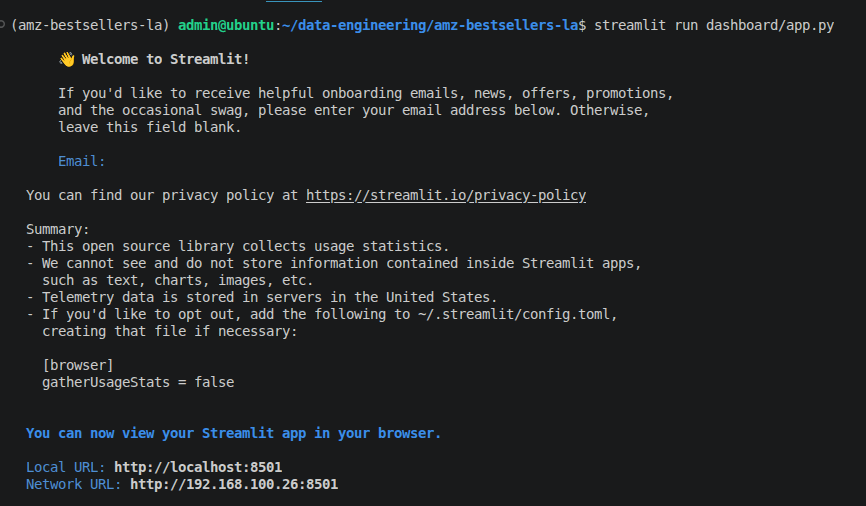

Web page would look like:

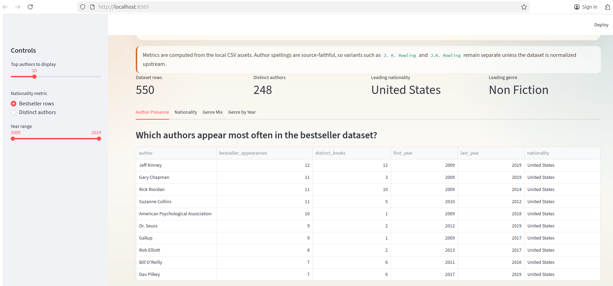


### Optional: Create The Infrastructure With Terraform

If you want Terraform to create and manage the infrastructure, run it locally with an admin-level Google Cloud identity.

```bash
export GOOGLE_APPLICATION_CREDENTIALS="$(pwd)/service-account.json"
export TF_VAR_project_id="your-gcp-project-id"
export TF_VAR_region="us-central1"

cd infrastructure/gcp
terraform init
terraform apply
```

If the bucket already exists and you want Terraform to manage it, import it before `terraform apply`:

```bash
export BUCKET_NAME="${TF_VAR_project_id}-amz-bestsellers-raw"
terraform import google_storage_bucket.data_lake "$BUCKET_NAME"
```

Important:

- use Terraform locally or from a privileged admin identity
- do not use the runtime pipeline service account for infrastructure creation

Image placeholder:


### Local Execution (Optional)

If you do not want to use GCP, use the local Docker environment:

```bash
cd infrastructure/local
terraform init
terraform apply
make infra-local
make pipeline
```

The expected cloud workflow is:

1. Provision infrastructure in GCP manually or with local Terraform
2. Upload batch files to the GCS raw data lake
3. Run the Bruin DAG to build staging, dimensions, and facts in BigQuery
4. Query the final tables and expose results in the dashboard

## Validation And Smoke Tests

Yes, you can and should use simple tests to confirm the infrastructure and data were created correctly.

### 1. Verify Infrastructure Exists

If you created the infrastructure manually:

```bash
gcloud storage buckets list --project="your-gcp-project-id"
bq ls --project_id "your-gcp-project-id"
gcloud iam service-accounts list --project="your-gcp-project-id"
```

Expected:

- the raw GCS bucket exists
- the `raw` dataset exists
- the `analytics` dataset exists
- the pipeline service account exists

If you created the infrastructure with Terraform:

```bash
terraform -chdir=infrastructure/gcp output
```

Expected:

- a raw GCS bucket name
- a `raw` BigQuery dataset
- an `analytics` BigQuery dataset
- a pipeline service account email

### 2. Verify Files Reached The Data Lake

```bash
gcloud storage ls "gs://${RAW_DATA_LAKE_BUCKET}/raw/"
```

Expected files:

- `bestsellers_with_categories.csv`
- `author_nationality_seed.csv`

### 3. Verify BigQuery Datasets Exist

```bash
bq ls --project_id "$TF_VAR_project_id"
```

Expected datasets:

- `raw`
- `analytics`

### 4. Verify The Core Analytical Tables Exist

```bash
bq ls "${TF_VAR_project_id}:analytics"
```

Expected tables:

- `fct_author_appearances`
- `fct_nationality_distribution`
- `fct_genre_overall`
- `fct_genre_by_year`

### 5. Verify Row Counts

```bash
bq query --use_legacy_sql=false \
'SELECT COUNT(*) AS row_count FROM `'"$TF_VAR_project_id"'.analytics.fct_author_appearances`'
```

Expected:

- a non-zero row count

```bash
bq query --use_legacy_sql=false \
'SELECT COUNT(*) AS row_count FROM `'"$TF_VAR_project_id"'.analytics.fct_genre_by_year`'
```

Expected:

- a non-zero row count

### 6. Verify The Dashboard

After launching Streamlit, confirm that the dashboard renders at least:

- the author appearance view
- the nationality distribution view
- the overall genre view
- the yearly genre view

### 7. Run Repo-Level Checks

```bash
make test
python3 -m py_compile \
  dashboard/app.py \
  pipeline/ingestion/enrich_author_nationality.py \
  pipeline/ingestion/upload_to_gcs.py \
  pipeline/assets/ingest_raw_files.py
```

These checks do not prove the whole cloud run succeeded, but they help catch formatting and code issues early.

Architecture placeholder:


## Naming Conventions

### Tables

- `raw_`: untouched data from source
- `stg_`: cleaned and casted staging data
- `fct_`: final analysis tables

### Terraform

Resource names use underscores, for example `google_storage_bucket.data_lake`.

### Bruin

Tasks are named by action, for example `ingest_kaggle` and `transform_genre_by_year`.

## Structure

```text
amazon-bestsellers-analytics-pipeline
├── .github/workflows/
├── infrastructure/
│   ├── gcp/
│   └── local/
├── pipeline/
│   ├── assets/
│   ├── ingestion/
│   └── transformations/
├── dashboard/
├── Makefile
├── README.md
└── ARCHITECTURE.md
```

## Project Theme

The current analytical focus is on four questions supported by the dataset:

- which authors appear most often in the bestseller dataset
- what nationality dominates in the dataset
- which genres dominate the dataset overall
- which genres dominate the dataset per year

The pipeline supports loading raw source data, standardizing it into staging models, and producing analytical fact tables for downstream reporting and dashboarding.

## Cloud Components

The cloud deployment now includes real IaC under [`infrastructure/gcp/`](/home/admin/data-engineering/amz-bestsellers-la/infrastructure/gcp):

- GCS raw data lake bucket
- BigQuery `raw` dataset
- BigQuery `analytics` dataset
- service account and IAM bindings for the pipeline

## Dataset Enrichment

The dataset is enriched with an author dimension workflow:

- `dim_authors` extracts the unique set of authors from `stg_bestsellers`
- `raw_author_nationality` stores a curated lookup of author to nationality
- `dim_author_nationality` joins the author list with the nationality lookup

Current seed status:

- `248` distinct author values extracted from `bestsellers_with_categories.csv`
- `248` author rows present in the nationality seed
- `7` entries currently marked as `Unknown` because they are organizations, pen names, or low-confidence matches

Starter files:

- [`dim_authors.sql`](/home/admin/data-engineering/amz-bestsellers-la/pipeline/transformations/dim_authors.sql)
- [`dim_author_nationality.sql`](/home/admin/data-engineering/amz-bestsellers-la/pipeline/transformations/dim_author_nationality.sql)
- [`author_nationality_seed.csv`](/home/admin/data-engineering/amz-bestsellers-la/pipeline/assets/author_nationality_seed.csv)

## Analytical Models

The core SQL models for the supported dashboard questions are:

- [`stg_bestsellers.sql`](/home/admin/data-engineering/amz-bestsellers-la/pipeline/transformations/stg_bestsellers.sql)
- [`fct_author_appearances.sql`](/home/admin/data-engineering/amz-bestsellers-la/pipeline/transformations/fct_author_appearances.sql)
- [`fct_nationality_distribution.sql`](/home/admin/data-engineering/amz-bestsellers-la/pipeline/transformations/fct_nationality_distribution.sql)
- [`fct_genre_overall.sql`](/home/admin/data-engineering/amz-bestsellers-la/pipeline/transformations/fct_genre_overall.sql)
- [`fct_genre_by_year.sql`](/home/admin/data-engineering/amz-bestsellers-la/pipeline/transformations/fct_genre_by_year.sql)

## Batch Orchestration

The Bruin pipeline definition lives at [`pipeline.yml`](/home/admin/data-engineering/amz-bestsellers-la/pipeline/pipeline.yml) and the runnable assets live under [`pipeline/assets/`](/home/admin/data-engineering/amz-bestsellers-la/pipeline/assets).

The end-to-end batch flow includes multiple steps:

1. seed `raw_bestsellers`
2. seed `raw_author_nationality`
3. run `ingest_raw_files` as the raw ingestion step
4. build `stg_bestsellers`
5. build dimensions and fact tables

This satisfies the multiple-step DAG requirement and includes a raw data lake upload step through [`upload_to_gcs.py`](/home/admin/data-engineering/amz-bestsellers-la/pipeline/ingestion/upload_to_gcs.py).

## Partitioning And Clustering

The warehouse strategy is designed around the dashboard queries:

- `stg_bestsellers` is partitioned by `year_partition_date` and clustered by `genre, author`
- `fct_genre_by_year` is partitioned by `year_partition_date` and clustered by `genre`
- `fct_author_appearances` is clustered by `author`
- `fct_nationality_distribution` is clustered by `nationality`

This makes sense because the main queries group by year, genre, author, and nationality.

## Dashboard

The Streamlit app at [`app.py`](/home/admin/data-engineering/amz-bestsellers-la/dashboard/app.py) visualizes the same four questions directly from the local asset files and includes more than two tiles.

### Where People See The Dashboard

People can see the dashboard in two ways:

1. locally, by running:

```bash
streamlit run dashboard/app.py
```

2. through a hosted deployment URL if you publish the app online

Because this is a demo course project and the dashboard reads from the CSV files committed in the repository, it is a good candidate for a simple hosted Streamlit deployment.

### Deploy The Dashboard

A simple option is to deploy it with Streamlit Community Cloud, which Streamlit documents as a good fit for personal, educational, and non-commercial apps:

- Streamlit deploy docs: https://docs.streamlit.io/deploy
- Streamlit Community Cloud getting started: https://docs.streamlit.io/deploy/streamlit-community-cloud/get-started

Suggested deployment steps:

1. push the repository to GitHub
2. make sure `requirements.txt` is present in the repo root
3. in Streamlit Community Cloud, create a new app from your GitHub repository
4. set the app entrypoint to `dashboard/app.py`
5. deploy and copy the public app URL into this README

Recommended README addition after deployment:

```text
Live dashboard: https://your-app-url.streamlit.app
```

Recommended screenshots to place in `docs/images/`:

- `step-01-manual-gcp-setup.png`
- `step-02-bruin-config.png`
- `step-03-pipeline-run.png`
- `step-04-dashboard.png`
- `step-05-terraform-infra.png`
- `architecture-overview.png`
- `dashboard-authors-tile.png`
- `dashboard-genres-tile.png`

Additional dashboard placeholders:


## Reproducibility

To reproduce the project:

1. install dependencies from [`requirements.txt`](/home/admin/data-engineering/amz-bestsellers-la/requirements.txt)
2. enable the required GCP APIs
3. authenticate with `service-account.json`
4. provision GCP resources with Terraform
5. configure Bruin using [`.bruin.yml.example`](/home/admin/data-engineering/amz-bestsellers-la/.bruin.yml.example)
6. upload the raw files from `pipeline/assets/` to GCS
7. run the Bruin pipeline
8. validate the infrastructure and data with the smoke tests above
9. launch the Streamlit dashboard

## Developer Workflow

When you change the repository, use this simple flow:

### If You Change Documentation Or Python Code

1. commit and push
2. GitHub automatically runs [`ci.yml`](/home/admin/data-engineering/amz-bestsellers-la/.github/workflows/ci.yml)

### If You Change Bruin Assets, Pipeline Logic, Or Cloud Infrastructure

1. commit and push
2. let [`ci.yml`](/home/admin/data-engineering/amz-bestsellers-la/.github/workflows/ci.yml) run automatically
3. manually trigger [`integration-cloud.yml`](/home/admin/data-engineering/amz-bestsellers-la/.github/workflows/integration-cloud.yml) from the GitHub Actions tab
4. review the smoke test results in BigQuery and GCS

Use the manual cloud integration workflow after changes to:

- SQL assets
- Bruin pipeline dependencies
- BigQuery table definitions
- partitioning or clustering settings
- ingestion scripts
- Terraform infrastructure

## CI/CD

The project uses two GitHub Actions workflows:

- [`ci.yml`](/home/admin/data-engineering/amz-bestsellers-la/.github/workflows/ci.yml)
  - runs on pushes and pull requests
  - checks `bruin format --check`
  - checks `terraform fmt -check -recursive`
  - compiles the Python application and ingestion files

- [`integration-cloud.yml`](/home/admin/data-engineering/amz-bestsellers-la/.github/workflows/integration-cloud.yml)
  - runs manually with `workflow_dispatch`
  - authenticates to GCP with Workload Identity Federation
  - applies Terraform infrastructure
  - uploads the raw files to GCS
  - runs the Bruin pipeline in BigQuery
  - executes smoke tests against the resulting datasets and fact tables

### GitHub Actions With GCP Workload Identity Federation

For CI, the repository is configured to authenticate to Google Cloud using Workload Identity Federation instead of storing a long-lived service account key in GitHub.

Create these GitHub repository values:

Secrets:

- `GCP_WORKLOAD_IDENTITY_PROVIDER`
- `GCP_SERVICE_ACCOUNT`

Variables:

- `GCP_PROJECT_ID`
- `GCP_REGION`

Recommended default:

- `GCP_REGION=us-central1`

Important note:

- `project_id` is not a secret
- `GCP_PROJECT_ID` should be stored as a GitHub Actions repository variable, not a secret
- the Workload Identity Provider resource name is generally treated as configuration, but storing it as a secret is acceptable if you prefer to keep your CI settings centralized
- the sensitive part is the credential itself, which WIF avoids storing in GitHub
